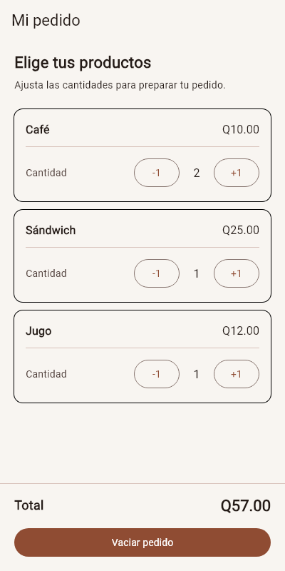

# Mi pedido de cafetería

Aplicación Flutter para armar un pedido con Café, Sándwich y Jugo. Los controles cambian las cantidades sin permitir valores negativos. El total se actualiza al instante y **Vaciar pedido** restablece todo a cero.

## Captura del pedido de Q57.00

Dos cafés, un sándwich y un jugo:



## ¿Cómo calcula el total?

La pantalla guarda la cantidad de cada producto en su estado local. Calcula `10 × cafés + 25 × sándwiches + 12 × jugos`; por ejemplo, `2 × 10 + 1 × 25 + 1 × 12 = Q57.00`. Cada cambio de cantidad llama a `setState`, por lo que Flutter vuelve a mostrar el total. `toStringAsFixed(2)` mantiene dos decimales.

## ¿Por qué conviene reutilizar ProductoPedido?

El mismo widget dibuja las tres filas y recibe nombre, precio, cantidad y acciones de los botones como parámetros. Así se evita repetir la interfaz y cualquier ajuste de diseño o controles se hace una sola vez.

## Ejecutar y probar

```bash
flutter run
flutter test
```
